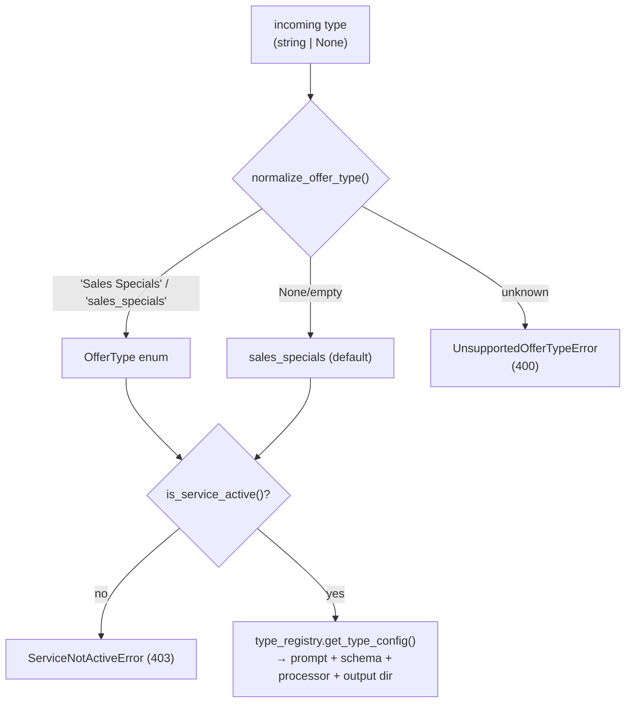

# Vehicle Offer Extraction

Scrapes automobile-dealer web pages, extracts structured offers with an LLM, and
packages the results per dealer. The service is driven entirely through a
**FastAPI HTTP API**. The pipeline is built around **multiple offer types**;
`sales_specials` is the default and the only one currently **active**.

- [Supported types](#supported-types)
- [How to start](#how-to-start)
- [API / curl](#api--curl)
- [How the code flows](#how-the-code-flows)
- [Single-run lock](#single-run-lock)
- [Parallel processing](#parallel-processing)
- [Output layout](#output-layout)
- [Adding a new offer type](#adding-a-new-offer-type)
- [Diagrammatic flow](#diagrammatic-flow)
- [Tests](#tests)

---

## Supported types

Only **active** types accept requests; a request for an inactive type is rejected
with **HTTP 403** (`service_not_active`). Activation is controlled per type via
env flags (see [`.env.example`](.env.example)).

| Internal value | Excel `type` label | Status |
|----------------|--------------------|--------|
| `sales_specials` *(default)* | Sales Specials | ✅ **active** |
| `service_specials` | Service Specials | ⛔ inactive |
| `schedule_service` | Schedule Service | ⛔ inactive |
| `new_inventory` | New Inventory | ⛔ inactive |
| `certified_inventory` | Certified Inventory | ⛔ inactive |
| `used_inventory` | Used Inventory | ⛔ inactive |
| `offer_to_purchase` | Offer To Purchase | ⛔ inactive |

Rows whose Excel `type` is **`Homepage`**, **`Contact Us`**, or **`Map`** are
skipped (logged, never fail the job). When no type is supplied, the app defaults
to `sales_specials`.

---

## How to start

### 1. Install

```bash
python -m venv venv
source venv/bin/activate
pip install -r requirements.txt
playwright install chromium   # one-time: browser for scraping
```

### 2. Configure `.env`

```bash
# One or more Gemini keys (comma-separated). Each concurrent LLM call uses a
# distinct key to spread load past a single key's rate limit.
GEMINI_API_KEY=your-gemini-api-key-here
# GEMINI_API_KEYS=key1,key2,key3,key4,key5

# Optional overrides (defaults shown)
SCRAPER_MAX_WORKERS=5
DEALER_EXTRACT_WORKERS=5
LOCAL_STORAGE_DIR=./storage/offers
DEFAULT_EXCEL_PATH=offers/vehicle_dealers.xlsx

# Service activation (only sales_specials is on)
sales_specials=true
service_specials=false
schedule_service=false
new_inventory=false
certified_inventory=false
used_inventory=false
offer_to_purchase=false
```

### 3. Run the API

```bash
uvicorn app.main:app --reload --port 8000
```

Health check: `curl http://localhost:8000/health` → `{"status":"ok"}`
Interactive docs: `http://localhost:8000/docs`

---

## API / curl

The API returns immediately (`processing`); scraping + extraction run on
background workers. Output is written under `storage/offers/<type>/`.

### Process the active type (`sales_specials`)

```bash
curl -X POST "http://localhost:8000/api/v1/offers/process" \
  -H "Content-Type: application/json" \
  -d '{
    "type": "sales_specials",
    "path": "/Users/Mkurikur/Documents/voe/VEHICLE_OFFER_EXTRACTION/offers/vehicle_dealers.xlsx"
  }'
```

### Default type (omit `type` → `sales_specials`)

```bash
curl -X POST "http://localhost:8000/api/v1/offers/process" \
  -H "Content-Type: application/json" \
  -d '{
    "path": "/Users/Mkurikur/Documents/voe/VEHICLE_OFFER_EXTRACTION/offers/vehicle_dealers.xlsx"
  }'
```

Success response:

```json
{
  "status": "processing",
  "message": "Your request has been accepted and is being processed. Offers will be generated in a few minutes.",
  "offer_type": "sales_specials",
  "excel_path": "offers/vehicle_dealers.xlsx",
  "run_id": "9de5b992c3f1",
  "output_dir": "storage/offers/20260911_163216_9de5b992c3f1",
  "correlation_id": "voe_df741bbb78a747d3a7b0a5d4bb92da5c"
}
```

Use the returned `run_id` to poll the run's final status (see below).

### Check a run's status (`GET /runs/{run_id}`)

Every run writes a `run_summary.json` into its output folder and exposes it here,
so you can always answer: did it finish, did it fail, how many URLs succeeded /
failed, and where the output files are. `status` is one of `queued`, `running`,
`completed`, `completed_with_errors`, or `failed`.

```bash
curl "http://localhost:8000/api/v1/offers/runs/9de5b992c3f1"
```
```json
{
  "run_id": "9de5b992c3f1",
  "offer_type": "sales_specials",
  "status": "completed_with_errors",
  "dealer_correlation_id": "voe_df741bbb78a747d3a7b0a5d4bb92da5c",
  "output_dir": "storage/offers/20260911_163216_9de5b992c3f1",
  "total_urls": 60,
  "successful": 57,
  "failed": 3,
  "started_at": "2026-09-11 16:32:16",
  "ended_at": "2026-09-11 16:33:04",
  "duration_seconds": 47.8,
  "dealer_count": 12,
  "no_offers_extracted": 0,
  "scraping_error_count": 1
}
```

Unknown `run_id` → HTTP 404 (`run_not_found`):

```json
{"error":{"code":"run_not_found",
  "message":"No run found with id 'abc123'."}}
```

### Inactive type → HTTP 403 (`service_not_active`)

```bash
curl -X POST "http://localhost:8000/api/v1/offers/process" \
  -H "Content-Type: application/json" \
  -d '{"type": "used_inventory", "path": "x.xlsx"}'
```
```json
{"error":{"code":"service_not_active",
  "message":"The 'used_inventory' service is not active."}}
```

### Invalid type → HTTP 400 (`unsupported_offer_type`)

```bash
curl -X POST "http://localhost:8000/api/v1/offers/process" \
  -H "Content-Type: application/json" \
  -d '{"type": "homepage", "path": "x.xlsx"}'
```
```json
{"error":{"code":"unsupported_offer_type",
  "message":"Unsupported offer type: homepage. Supported types are: sales_specials, service_specials, schedule_service, new_inventory, certified_inventory, used_inventory, offer_to_purchase."}}
```

### Run already in progress → HTTP 409 (`offer_run_in_progress`)

```json
{"error":{"code":"offer_run_in_progress",
  "message":"An offer-generation run for 'sales_specials' is currently running. Please wait until it completes before starting another."}}
```

### List supported types

```bash
curl "http://localhost:8000/api/v1/offers/types"
```
```json
{"supported":["sales_specials","service_specials","schedule_service","new_inventory","certified_inventory","used_inventory","offer_to_purchase"],"default":"sales_specials"}
```

### Backwards-compatible endpoint

`GET /generate` still works and defaults to `sales_specials`:

```bash
curl "http://localhost:8000/api/v1/offers/generate?excel_path=offers/vehicle_dealers.xlsx"
curl "http://localhost:8000/api/v1/offers/generate?excel_path=offers/vehicle_dealers.xlsx&type=sales_specials"
```

---

## How the code flows

End to end, a single request travels through three stages (A → B → C):

1. **A — Request (`app/api/offers.py`)**
   - `POST /api/v1/offers/process` (or `GET /generate`) receives `{type?, path?}`.
   - `normalize_offer_type()` resolves the type (defaulting to `sales_specials`);
     an unknown value raises `UnsupportedOfferTypeError` (**400**).
   - `settings.is_service_active()` rejects an inactive type with
     `ServiceNotActiveError` (**403**).
   - `run_lock.acquire()` enforces one run at a time; a busy lock raises
     `OfferRunInProgressError` (**409**).
   - On success it publishes `{excel_path, offer_type}` to the **scrape broker**
     and returns `processing` immediately.

2. **B — Scrape (`app/events/subscriber.py::handle_scrape_event`)**
   - A single background worker picks up the event, resolves the processor via
     `type_registry.get_processor()`, and calls `processor.scrape()`.
   - The Excel workbook is read and filtered by the type's Excel label
     (`Homepage` / `Contact Us` / `Map` rows are skipped).
   - Dealer URLs are scraped in parallel (`SCRAPER_MAX_WORKERS`). As each
     dealer's URLs finish, that dealer is published to the **extract broker**, so
     extraction overlaps with remaining scraping.

3. **C — Extract (`app/events/subscriber.py::handle_extract_event`)**
   - Multiple workers (`DEALER_EXTRACT_WORKERS`) each handle one dealer.
   - The processor runs the type's **prompt + response schema** through the LLM
     (`app/service/llm_extractor.py`), formats results, and writes a per-dealer
     ZIP (and an error file for failures) under `storage/offers/<type>/`.
   - When the last dealer completes, the run's total duration is logged and
     `run_lock` is released so the next request can start.

Type wiring lives in `app/config/type_registry.py`, which maps each
`OfferType` to its prompt, response schema, processor, and output subfolder — the
single place a type is defined end to end. See
[`docs/ARCHITECTURE.md`](docs/ARCHITECTURE.md) for the stage-by-stage internals.

---

## Single-run lock

Only **one** offer-generation run may be in flight at any moment, preventing a new
request from interrupting or piling up behind work already in progress
(`app/events/run_lock.py`).

- No run active → the run starts and returns the normal `processing` response.
- A run active → the request is rejected immediately with **HTTP 409**, naming the
  offer type currently running.

The lock is released automatically when the run finishes (all dealers extracted)
or if scraping fails before any dealer is dispatched.

---

## Parallel processing

Two independent worker pools, **both default to 5**:

| Setting | Default | Meaning |
|---------|---------|---------|
| `SCRAPER_MAX_WORKERS` | **5** | Dealer URLs scraped in parallel (stage B). Each worker runs its own headless Chromium. |
| `DEALER_EXTRACT_WORKERS` | **5** | Dealers whose offers are extracted in parallel (stage C). Keep near the number of LLM keys. |

LLM concurrency is naturally capped by the API-key pool: at most `len(keys)`
extractions run at once, each on a distinct key. Scraper and LLM concurrency are
decoupled.

---

## Output layout

Every type writes only under its own subfolder — ZIPs and errors never mix:

```
storage/offers/
├── sales_specials/
│   ├── zip/      <dealer>_<date>.zip     # one .xlsx per OEM with offers
│   └── errors/   error_<dealer>_<date>.txt
└── ... (one folder per type)
```

Path helpers: `app/utils/output_paths.py` —
`get_output_directory(type)`, `get_zip_directory(type)`, `get_error_directory(type)`.

---

## Adding a new offer type

Adding a type touches only config + three small files:

1. Add a value to `OfferType` and its Excel label in `app/config/offer_types.py`.
2. Create `app/prompts/<type>.py` (a `SYSTEM_PROMPT`).
3. Create `app/response_templates/<type>.py` (a `RESPONSE_SCHEMA`).
4. Create `app/processors/<type>_processor.py` (subclass `BaseProcessor`).
5. Register the processor in `app/config/type_registry.py` and add an activation
   flag in `app/core/config.py` (set it `true` to enable requests).

The API and broker all route through the registry — no other files change.

---

## Diagrammatic flow

### Type routing

```mermaid
flowchart LR
    API["POST /api/v1/offers/process<br/>{type?, path?}"]
    REG["type_registry.get_processor(offer_type)<br/>(default: sales_specials)"]
    P1["SalesSpecialsProcessor<br/>(active)"]
    P2["6× inactive processors<br/>(shared base)"]
    OUT["storage/offers/&lt;type&gt;/{zip,errors}"]

    API -->|publish {offer_type, excel_path}| REG
    REG --> P1
    REG -.-> P2
    P1 --> OUT
```

### Request lifecycle (A → B → C)

```mermaid
flowchart LR
    A["A — API request<br/>normalize + active check + lock"]
    B["B — scrape_broker<br/>1 worker"]
    C["C — extract_broker<br/>5 workers"]
    Z["storage/offers/&lt;type&gt;/"]

    A -->|publish {offer_type, excel_path}| B
    B -->|read Excel, filter by type label,<br/>skip Homepage/Contact Us/Map| B
    B -->|scrape URLs in parallel ×5| B
    B -->|publish 1 msg/dealer| C
    C -->|processor.build_dealer<br/>dealers parallel ×5| C
    C --> Z
```

### How the type is resolved



---

## Tests

**38 tests total** — 35 run by default (fast, fully offline: no network, no
browser, no LLM), and **3 are opt-in live checks** that are skipped unless you
explicitly enable them (see [Opt-in live checks](#opt-in-live-checks)).

### Run everything

```bash
pytest -q
```

Runs the whole offline suite. Use this before every commit — it verifies the API
surface, type routing, Excel filtering, output isolation, and the full run
lifecycle (lock, run status, failure handling) without touching the internet.

### Run every test individually

Each test below has its **own command in its own box** with a short explanation of
what it proves and how to run it. Running one test at a time is the fastest way to
reproduce or debug a single behavior.

#### `tests/test_offer_types.py` — type resolution

No type in the request resolves to the default, `sales_specials`:

```bash
pytest tests/test_offer_types.py::test_default_is_sales_specials -q
```

Both the internal value (`sales_specials`) and the Excel label (`Sales Specials`) resolve to the same type:

```bash
pytest tests/test_offer_types.py::test_normalize_accepts_internal_and_labels -q
```

The list of supported types is complete and correct:

```bash
pytest tests/test_offer_types.py::test_supported_values -q
```

An unknown type raises an error that lists the allowed values:

```bash
pytest tests/test_offer_types.py::test_invalid_type_raises_with_allowed_list -q
```

#### `tests/test_api.py` — HTTP contract

`GET /types` returns the supported list plus the default:

```bash
pytest tests/test_api.py::test_list_types -q
```

`POST /process` with no type falls back to `sales_specials`:

```bash
pytest tests/test_api.py::test_process_defaults_to_sales_specials -q
```

`POST /process` with an explicit active type is accepted:

```bash
pytest tests/test_api.py::test_process_explicit_type -q
```

An inactive type is rejected with **403 `service_not_active`**:

```bash
pytest tests/test_api.py::test_inactive_service_returns_403 -q
```

An invalid type is rejected with **400 `unsupported_offer_type`**:

```bash
pytest tests/test_api.py::test_process_invalid_type_returns_error -q
```

A missing workbook returns **404 `excel_file_not_found`**:

```bash
pytest tests/test_api.py::test_missing_excel_file_returns_404 -q
```

A missing Gemini key returns **500 `llm_configuration_error`**:

```bash
pytest tests/test_api.py::test_missing_gemini_key_returns_error -q
```

An unwritable storage dir returns **500 `output_directory_error`**:

```bash
pytest tests/test_api.py::test_unwritable_output_dir_returns_error -q
```

A second request while a run is active is rejected with **409 `offer_run_in_progress`**:

```bash
pytest tests/test_api.py::test_second_request_while_running_is_rejected -q
```

The single-run lock frees up after a run finishes:

```bash
pytest tests/test_api.py::test_lock_releases_after_run_completes -q
```

The lock frees up even when processor initialization fails:

```bash
pytest tests/test_api.py::test_lock_releases_when_processor_init_fails -q
```

#### `tests/test_filtering.py` — Excel row filtering

By default only `Sales Specials` rows are scraped:

```bash
pytest tests/test_filtering.py::test_default_processes_only_sales_specials -q
```

An explicit type keeps only that type's rows:

```bash
pytest tests/test_filtering.py::test_explicit_type_filters_rows -q
```

`Homepage` / `Contact Us` / `Map` rows are skipped, never errored:

```bash
pytest tests/test_filtering.py::test_unsupported_rows_are_skipped_not_failed -q
```

Dealers with `status=False` are excluded:

```bash
pytest tests/test_filtering.py::test_status_false_dealers_are_excluded -q
```

The `status` column accepts string values like `"TRUE"` / `"false"`:

```bash
pytest tests/test_filtering.py::test_status_accepts_string_true -q
```

The `status` column accepts numeric `1` / `0`:

```bash
pytest tests/test_filtering.py::test_status_accepts_numeric_0_and_1 -q
```

#### `tests/test_processors.py` — per-type behavior + isolation

A dealer's output ZIP is written into the active run folder:

```bash
pytest tests/test_processors.py::test_used_inventory_output_written_to_run_folder -q
```

Scrape errors are written to the run's `errors/` directory:

```bash
pytest tests/test_processors.py::test_scrape_error_written_to_run_error_dir -q
```

Sales Specials delegates to the real extraction service:

```bash
pytest tests/test_processors.py::test_sales_specials_processor_delegates_to_real_service -q
```

The same dealer processed twice on the same day writes to separate run folders (outputs never mix):

```bash
pytest tests/test_processors.py::test_case7_same_dealer_twice_same_day_outputs_do_not_mix -q
```

#### `tests/test_output_paths.py` — output isolation

Output paths are scoped to the active run:

```bash
pytest tests/test_output_paths.py::test_output_directories_are_run_scoped -q
```

Two separate runs never share a folder:

```bash
pytest tests/test_output_paths.py::test_separate_runs_use_separate_folders -q
```

#### `tests/test_reliability.py` — run lifecycle at the real (~60-URL) workload

Missing key → run **failed** → lock released → the next run can start:

```bash
pytest tests/test_reliability.py::test_case1_missing_key_fails_releases_lock_then_next_run_starts -q
```

A missing Excel file returns an error immediately:

```bash
pytest tests/test_reliability.py::test_case2_missing_excel_returns_error_immediately -q
```

60 URLs all succeed:

```bash
pytest tests/test_reliability.py::test_case3_sixty_urls_all_succeed -q
```

60 URLs with 5 failures → 55 succeed + 5 fail, and the run still completes:

```bash
pytest tests/test_reliability.py::test_case4_sixty_urls_five_failures_still_completes -q
```

A background crash marks the run **failed** and releases the lock:

```bash
pytest tests/test_reliability.py::test_case8_background_crash_marks_run_failed -q
```

An unwritable output dir makes the run report **failed**:

```bash
pytest tests/test_reliability.py::test_case9_unwritable_output_dir_reports_failed -q
```

#### `tests/test_docker_build_context.py` — image hygiene

`.env` is excluded from the Docker build context:

```bash
pytest tests/test_docker_build_context.py::test_case10_env_excluded_from_docker_build_context -q
```

`.env.*` variants (e.g. `.env.local`) are excluded from the Docker build context:

```bash
pytest tests/test_docker_build_context.py::test_case10_env_variants_excluded_from_docker_build_context -q
```

#### `tests/test_gemini_connectivity.py` — opt-in live check

Verifies the configured Gemini **key + base URL + model** actually work together. Needs `RUN_LIVE_GEMINI=1`; `-s -v` shows the request/result detail:

```bash
RUN_LIVE_GEMINI=1 pytest tests/test_gemini_connectivity.py::test_gemini_key_url_and_model_are_reachable -s -v
```

#### `tests/test_live_scrape.py` — opt-in live check

One real bot-protected dealer page returns non-empty body text. Needs `RUN_LIVE_SCRAPE=1`; quote the node ID because it contains a URL in `[...]`:

```bash
RUN_LIVE_SCRAPE=1 pytest "tests/test_live_scrape.py::test_bot_protected_url_returns_body[https://www.heywardallen.com/new-vehicles/new-vehicle-specials/]" -s -v
```

A second real page returns non-empty body text:

```bash
RUN_LIVE_SCRAPE=1 pytest "tests/test_live_scrape.py::test_bot_protected_url_returns_body[https://www.heywardallencadillac.com/new-vehicles/dealer-specials/]" -s -v
```

> Tip: quote any node ID that contains a URL in `[...]` (as above) so the shell
> doesn't try to expand the brackets.

### What each file verifies

| Test file | Tests | What it verifies | Why it's useful |
|-----------|:-----:|------------------|-----------------|
| `tests/test_offer_types.py` | 4 | Default resolves to `sales_specials`; label/alias normalization; unsupported type raises with the allowed list. | Guards type resolution — the entry point every request goes through. |
| `tests/test_api.py` | 11 | `/types` listing; default → `sales_specials`; explicit active type; **inactive type → 403**; invalid type → 400; missing Excel → 404; missing key → 500; single-run lock → 409; lock releases after a run / on processor-init failure. | Locks down the HTTP contract and every error code callers depend on. |
| `tests/test_filtering.py` | 6 | Excel rows filtered by type label; `Homepage`/`Contact Us`/`Map` skipped; `status` column parsed as active/inactive (bool, string, numeric). | Ensures only the intended dealer rows are scraped. |
| `tests/test_processors.py` | 4 | Sales Specials delegates to the real extraction logic; per-type processor wiring; scrape errors written to the run's `errors/` dir; **same dealer processed twice on the same day writes to separate run folders** (outputs never mix). | Confirms per-type behavior and run-to-run output isolation. |
| `tests/test_output_paths.py` | 2 | Each type/run writes only under its own run folder (`zip/`, `errors/`). | Prevents two runs' files from colliding. |
| `tests/test_reliability.py` | 6 | Missing key → run **failed** → lock released → next run starts; **60 URLs all succeed**; **60 URLs with 5 failures → 55 ok + 5 failed, run still completes**; background crash → run **failed**; missing Excel → immediate error; unwritable output dir → **failed**. | Proves the run lifecycle stays reliable at the real ~60-URL workload, including partial failures and crashes. |
| `tests/test_docker_build_context.py` | 2 | `.dockerignore` excludes `.env` and `.env.*` from the Docker build context. | Stops secrets from being baked into the image. |
| `tests/test_gemini_connectivity.py` | 1 | *(opt-in)* The configured Gemini **key + base URL + model** actually work together. | Early warning if Gemini changes a URL or retires a model. |
| `tests/test_live_scrape.py` | 2 | *(opt-in)* Real bot-protected dealer pages return non-empty body text via Playwright. | Verifies the live scraper against real anti-bot walls. |

### Run a single file or test

```bash
pytest tests/test_api.py -q                                  # one file
pytest tests/test_api.py::test_inactive_service_returns_403 -q  # one test
pytest tests/test_reliability.py -q                          # run-lifecycle cases
pytest -k "sixty_urls" -q                                    # match by name
```

Useful when iterating on one area — runs only what you're changing instead of the
whole suite.

### Opt-in live checks

These are **skipped by default** because they hit the real internet / real Gemini.
Enable them explicitly when you want to validate the live integrations:

```bash
# Verify the Gemini key, base URL, and model still work together.
# Fails loudly (instead of every real run failing) if Gemini changed a URL
# or retired the configured model.
RUN_LIVE_GEMINI=1 pytest tests/test_gemini_connectivity.py -s -v

# Verify the live scraper clears real bot-protection walls.
RUN_LIVE_SCRAPE=1 pytest tests/test_live_scrape.py -s -v

# Optionally point the live scrape at your own URLs:
RUN_LIVE_SCRAPE=1 LIVE_SCRAPE_URLS="https://a.com,https://b.com" \
  pytest tests/test_live_scrape.py -s -v
```

`-s` shows the printed diagnostics (page titles, body sizes, error detail) and
`-v` lists each URL/case by name.
