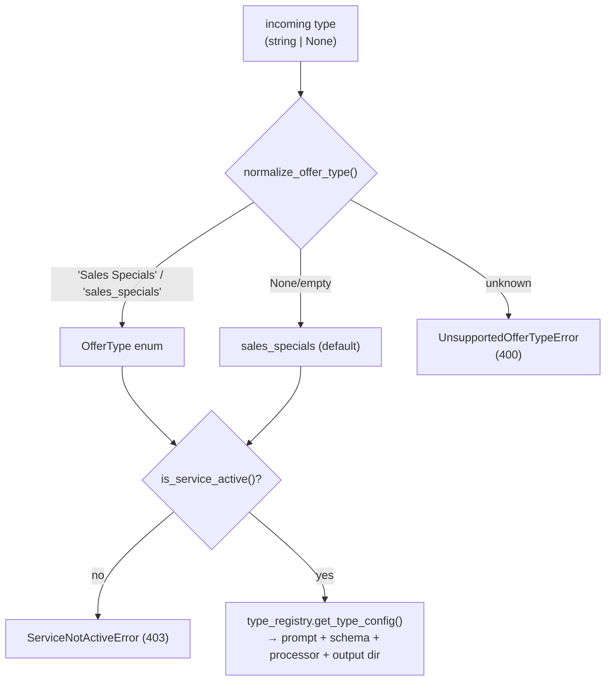

# Vehicle Offer Extraction

Scrapes automobile-dealer web pages, extracts structured offers with an LLM, and
packages the results per dealer. The service is driven entirely through a
**FastAPI HTTP API**. The pipeline is built around **multiple offer types**;
`sales_specials` is the default and the only one currently **active**.

- [Supported types](#supported-types)
- [How to start](#how-to-start)
- [API / curl](#api--curl)
- [How the code flows](#how-the-code-flows)
- [Single-run lock](#single-run-lock)
- [Parallel processing](#parallel-processing)
- [Output layout](#output-layout)
- [Adding a new offer type](#adding-a-new-offer-type)
- [Diagrammatic flow](#diagrammatic-flow)
- [Tests](#tests)

---

## Supported types

Only **active** types accept requests; a request for an inactive type is rejected
with **HTTP 403** (`service_not_active`). Activation is controlled per type via
env flags (see [`.env.example`](.env.example)).

| Internal value | Excel `type` label | Status |
|----------------|--------------------|--------|
| `sales_specials` *(default)* | Sales Specials | ✅ **active** |
| `service_specials` | Service Specials | ⛔ inactive |
| `schedule_service` | Schedule Service | ⛔ inactive |
| `new_inventory` | New Inventory | ⛔ inactive |
| `certified_inventory` | Certified Inventory | ⛔ inactive |
| `used_inventory` | Used Inventory | ⛔ inactive |
| `offer_to_purchase` | Offer To Purchase | ⛔ inactive |

Rows whose Excel `type` is **`Homepage`**, **`Contact Us`**, or **`Map`** are
skipped (logged, never fail the job). When no type is supplied, the app defaults
to `sales_specials`.

---

## How to start

### 1. Install

```bash
python -m venv venv
source venv/bin/activate
pip install -r requirements.txt
playwright install chromium   # one-time: browser for scraping
```

### 2. Configure `.env`

```bash
# One or more Gemini keys (comma-separated). Each concurrent LLM call uses a
# distinct key to spread load past a single key's rate limit.
GEMINI_API_KEY=your-gemini-api-key-here
# GEMINI_API_KEYS=key1,key2,key3,key4,key5

# Optional overrides (defaults shown)
SCRAPER_MAX_WORKERS=5
DEALER_EXTRACT_WORKERS=5
LOCAL_STORAGE_DIR=./storage/offers
DEFAULT_EXCEL_PATH=offers/MWK00012GMC_Dealership_URLs.xlsx

# Service activation (only sales_specials is on)
sales_specials=true
service_specials=false
schedule_service=false
new_inventory=false
certified_inventory=false
used_inventory=false
offer_to_purchase=false
```

### 3. Run the API

```bash
uvicorn app.main:app --reload --port 8000
```

Health check: `curl http://localhost:8000/health` → `{"status":"ok"}`
Interactive docs: `http://localhost:8000/docs`

---

## API / curl

The API returns immediately (`processing`); scraping + extraction run on
background workers. Output is written under `storage/offers/<type>/`.

### Process the active type (`sales_specials`)

```bash
curl -X POST "http://localhost:8000/api/v1/offers/process" \
  -H "Content-Type: application/json" \
  -d '{
    "type": "sales_specials",
    "path": "/Users/Mkurikur/Documents/voe/VEHICLE_OFFER_EXTRACTION/offers/example.xlsx"
  }'
```

### Default type (omit `type` → `sales_specials`)

```bash
curl -X POST "http://localhost:8000/api/v1/offers/process" \
  -H "Content-Type: application/json" \
  -d '{
    "path": "/Users/Mkurikur/Documents/voe/VEHICLE_OFFER_EXTRACTION/offers/example.xlsx"
  }'
```

Success response:

```json
{
  "status": "processing",
  "message": "Your request has been accepted and is being processed. Offers will be generated in a few minutes.",
  "offer_type": "sales_specials",
  "excel_path": "offers/example.xlsx"
}
```

### Inactive type → HTTP 403 (`service_not_active`)

```bash
curl -X POST "http://localhost:8000/api/v1/offers/process" \
  -H "Content-Type: application/json" \
  -d '{"type": "used_inventory", "path": "x.xlsx"}'
```
```json
{"error":{"code":"service_not_active",
  "message":"The 'used_inventory' service is not active."}}
```

### Invalid type → HTTP 400 (`unsupported_offer_type`)

```bash
curl -X POST "http://localhost:8000/api/v1/offers/process" \
  -H "Content-Type: application/json" \
  -d '{"type": "homepage", "path": "x.xlsx"}'
```
```json
{"error":{"code":"unsupported_offer_type",
  "message":"Unsupported offer type: homepage. Supported types are: sales_specials, service_specials, schedule_service, new_inventory, certified_inventory, used_inventory, offer_to_purchase."}}
```

### Run already in progress → HTTP 409 (`offer_run_in_progress`)

```json
{"error":{"code":"offer_run_in_progress",
  "message":"An offer-generation run for 'sales_specials' is currently running. Please wait until it completes before starting another."}}
```

### List supported types

```bash
curl "http://localhost:8000/api/v1/offers/types"
```
```json
{"supported":["sales_specials","service_specials","schedule_service","new_inventory","certified_inventory","used_inventory","offer_to_purchase"],"default":"sales_specials"}
```

### Backwards-compatible endpoint

`GET /generate` still works and defaults to `sales_specials`:

```bash
curl "http://localhost:8000/api/v1/offers/generate?excel_path=offers/example.xlsx"
curl "http://localhost:8000/api/v1/offers/generate?excel_path=offers/example.xlsx&type=sales_specials"
```

---

## How the code flows

End to end, a single request travels through three stages (A → B → C):

1. **A — Request (`app/api/offers.py`)**
   - `POST /api/v1/offers/process` (or `GET /generate`) receives `{type?, path?}`.
   - `normalize_offer_type()` resolves the type (defaulting to `sales_specials`);
     an unknown value raises `UnsupportedOfferTypeError` (**400**).
   - `settings.is_service_active()` rejects an inactive type with
     `ServiceNotActiveError` (**403**).
   - `run_lock.acquire()` enforces one run at a time; a busy lock raises
     `OfferRunInProgressError` (**409**).
   - On success it publishes `{excel_path, offer_type}` to the **scrape broker**
     and returns `processing` immediately.

2. **B — Scrape (`app/events/subscriber.py::handle_scrape_event`)**
   - A single background worker picks up the event, resolves the processor via
     `type_registry.get_processor()`, and calls `processor.scrape()`.
   - The Excel workbook is read and filtered by the type's Excel label
     (`Homepage` / `Contact Us` / `Map` rows are skipped).
   - Dealer URLs are scraped in parallel (`SCRAPER_MAX_WORKERS`). As each
     dealer's URLs finish, that dealer is published to the **extract broker**, so
     extraction overlaps with remaining scraping.

3. **C — Extract (`app/events/subscriber.py::handle_extract_event`)**
   - Multiple workers (`DEALER_EXTRACT_WORKERS`) each handle one dealer.
   - The processor runs the type's **prompt + response schema** through the LLM
     (`app/service/llm_extractor.py`), formats results, and writes a per-dealer
     ZIP (and an error file for failures) under `storage/offers/<type>/`.
   - When the last dealer completes, the run's total duration is logged and
     `run_lock` is released so the next request can start.

Type wiring lives in `app/config/type_registry.py`, which maps each
`OfferType` to its prompt, response schema, processor, and output subfolder — the
single place a type is defined end to end. See
[`docs/ARCHITECTURE.md`](docs/ARCHITECTURE.md) for the stage-by-stage internals.

---

## Single-run lock

Only **one** offer-generation run may be in flight at any moment, preventing a new
request from interrupting or piling up behind work already in progress
(`app/events/run_lock.py`).

- No run active → the run starts and returns the normal `processing` response.
- A run active → the request is rejected immediately with **HTTP 409**, naming the
  offer type currently running.

The lock is released automatically when the run finishes (all dealers extracted)
or if scraping fails before any dealer is dispatched.

---

## Parallel processing

Two independent worker pools, **both default to 5**:

| Setting | Default | Meaning |
|---------|---------|---------|
| `SCRAPER_MAX_WORKERS` | **5** | Dealer URLs scraped in parallel (stage B). Each worker runs its own headless Chromium. |
| `DEALER_EXTRACT_WORKERS` | **5** | Dealers whose offers are extracted in parallel (stage C). Keep near the number of LLM keys. |

LLM concurrency is naturally capped by the API-key pool: at most `len(keys)`
extractions run at once, each on a distinct key. Scraper and LLM concurrency are
decoupled.

---

## Output layout

Every type writes only under its own subfolder — ZIPs and errors never mix:

```
storage/offers/
├── sales_specials/
│   ├── zip/      <dealer>_<date>.zip     # one .xlsx per OEM with offers
│   └── errors/   error_<dealer>_<date>.txt
└── ... (one folder per type)
```

Path helpers: `app/utils/output_paths.py` —
`get_output_directory(type)`, `get_zip_directory(type)`, `get_error_directory(type)`.

---

## Adding a new offer type

Adding a type touches only config + three small files:

1. Add a value to `OfferType` and its Excel label in `app/config/offer_types.py`.
2. Create `app/prompts/<type>.py` (a `SYSTEM_PROMPT`).
3. Create `app/response_templates/<type>.py` (a `RESPONSE_SCHEMA`).
4. Create `app/processors/<type>_processor.py` (subclass `BaseProcessor`).
5. Register the processor in `app/config/type_registry.py` and add an activation
   flag in `app/core/config.py` (set it `true` to enable requests).

The API and broker all route through the registry — no other files change.

---

## Diagrammatic flow

### Type routing

```mermaid
flowchart LR
    API["POST /api/v1/offers/process<br/>{type?, path?}"]
    REG["type_registry.get_processor(offer_type)<br/>(default: sales_specials)"]
    P1["SalesSpecialsProcessor<br/>(active)"]
    P2["6× inactive processors<br/>(shared base)"]
    OUT["storage/offers/&lt;type&gt;/{zip,errors}"]

    API -->|publish {offer_type, excel_path}| REG
    REG --> P1
    REG -.-> P2
    P1 --> OUT
```

### Request lifecycle (A → B → C)

```mermaid
flowchart LR
    A["A — API request<br/>normalize + active check + lock"]
    B["B — scrape_broker<br/>1 worker"]
    C["C — extract_broker<br/>5 workers"]
    Z["storage/offers/&lt;type&gt;/"]

    A -->|publish {offer_type, excel_path}| B
    B -->|read Excel, filter by type label,<br/>skip Homepage/Contact Us/Map| B
    B -->|scrape URLs in parallel ×5| B
    B -->|publish 1 msg/dealer| C
    C -->|processor.build_dealer<br/>dealers parallel ×5| C
    C --> Z
```

### How the type is resolved



---

## Tests

```bash
pytest -q
```

**22 tests** cover the full API surface and type routing:

| Test file | What it verifies |
|-----------|------------------|
| `tests/test_offer_types.py` | Default resolves to `sales_specials`; label/alias normalization; unsupported type raises with the allowed list. |
| `tests/test_api.py` | `/types` listing; default → `sales_specials`; explicit active type; **inactive type → 403**; invalid type → 400; single-run lock → 409; lock release after a run completes. |
| `tests/test_filtering.py` | Excel rows filtered by type label; `Homepage`/`Contact Us`/`Map` skipped. |
| `tests/test_processors.py` | Sales Specials delegates to the original extraction logic; per-type processor wiring. |
| `tests/test_output_paths.py` | Output isolation — each type writes only under its own `zip/` and `errors/` folder. |

Run a single file or test:

```bash
pytest tests/test_api.py -q
pytest tests/test_api.py::test_inactive_service_returns_403 -q
```
